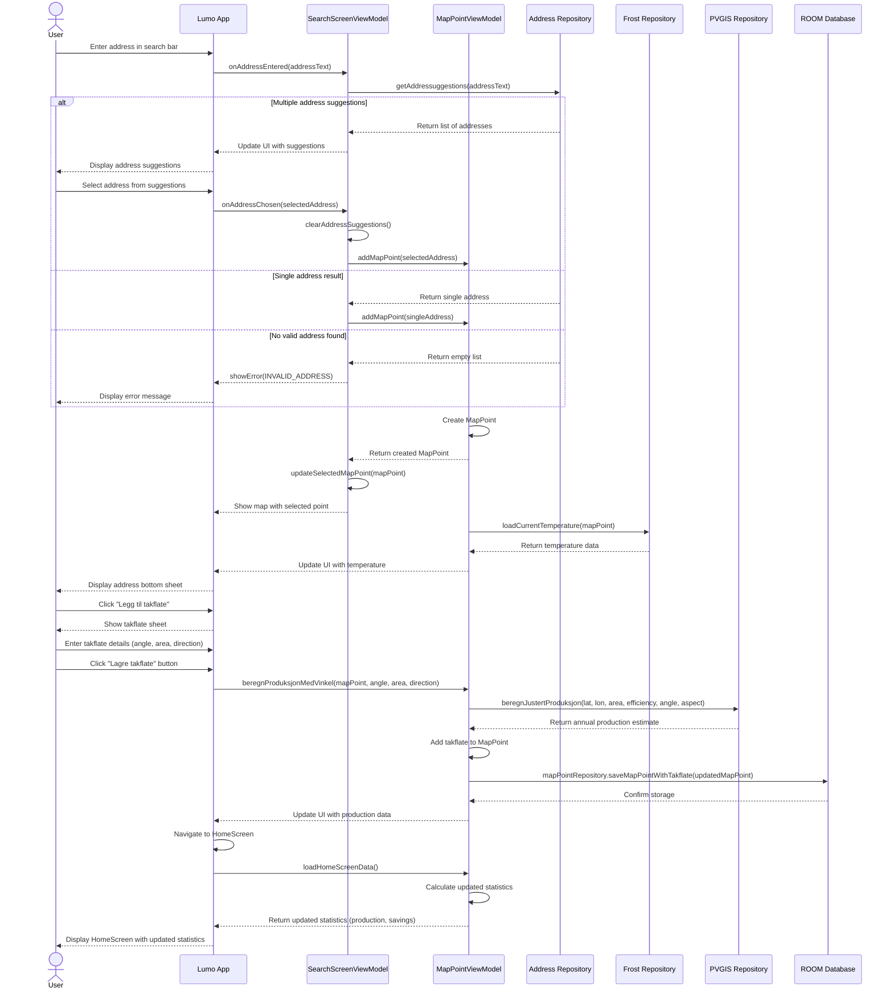
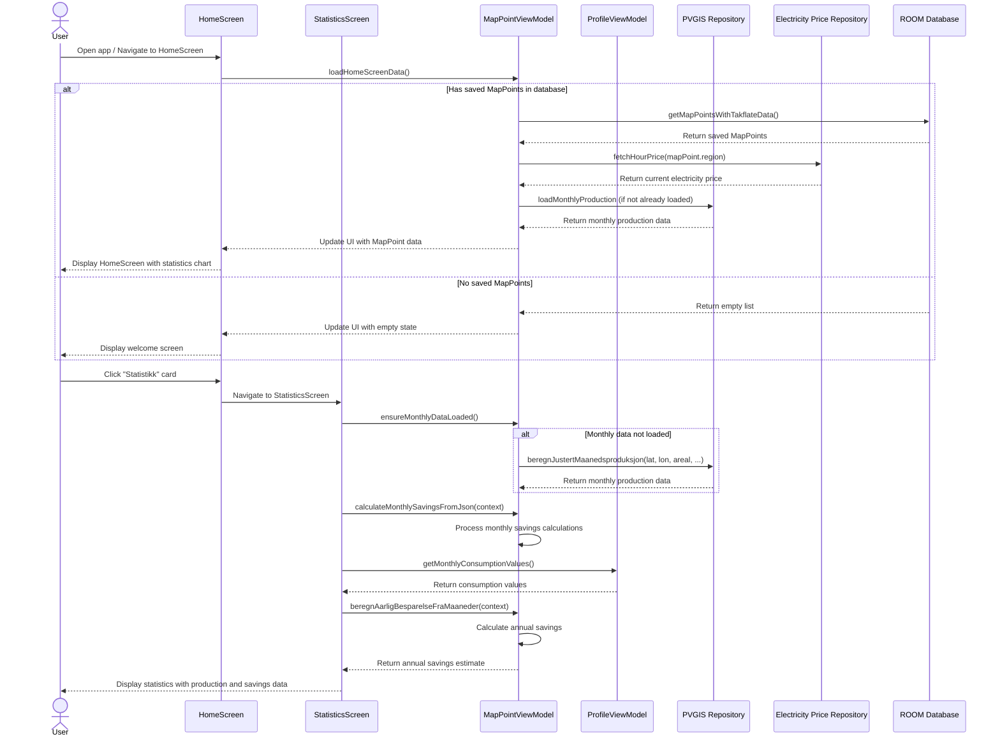
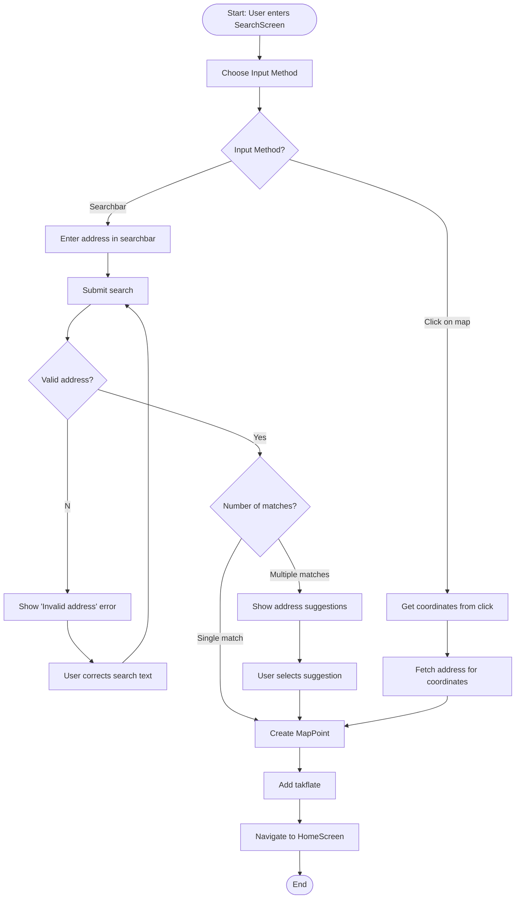
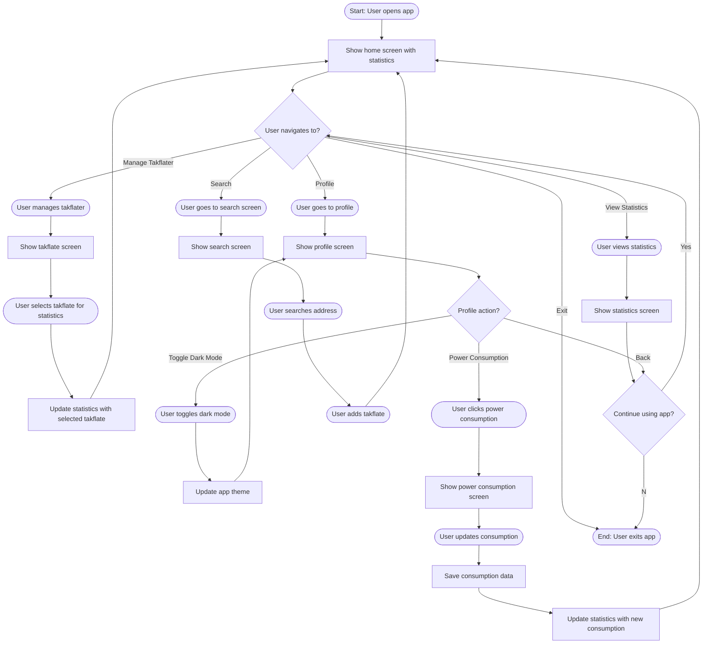

# Modellering og systemdesign

## ARKITEKTURSKISSE

## USE CASE
[UseCase.pdf](https://github.uio.no/IN2000-V25/team-33/files/583/UseCase.pdf)

**Use Case: Finn adresse og legg til takflate** \
Primæraktør: Bruker \
Sekundæraktører: Geonorge API, PVGIS API \
Prebetingelse: Ingen \
Postbetingelse: Bruker har lagret bolig med takflate

**Hovedflyt:** 
1. Brukeren åpner applikasjonen
2. Brukeren søker etter spesifikk adresse
3. Applikasjonen henter koordinater og stedsdata fra Geonorge API
4. Brukeren legger til takflate, og oppgir areal, vinkel og retning

**Alternativ flyt:** \
2.1: Brukeren trykker på ønsket bolig direkte på kartet \
2.2: Ingen gyldig addresse ble funnet \
2.3: Brukeren oppgir ny addresse eller avslutter.
git status
&nbsp;

**Use Case: Se statestikk** \
Primæraktør: Bruker \
Sekundæraktører: FrostAPI, PVGIS API, hvakosterstrommen API \
Prebetingelse: Brukeren har lagt til bolig og tilhørende takflate \
Postbetingelse: Brukeren har fått estimert strømproduksjon for takflate(r) basert på soldata og værdata 

**Hovedflyt:**
1. Bruker er inne på applikasjonen
2. Bruker trykker på HJEM-knappen
3. Applikasjonen henter solinstråling og produksjonsdata fra PVGIS api
4. Applikasjonen henter værhistorikk fra Frost API
5. Applikasjonen henter strømprisinformasjon fra hvakosterstrommen API
6. Systemet viser relevant statistikk for brukerens takflater

&nbsp;

**Use Case: Legg til ny takflate** \
Primæraktør: Bruker \
Sekundæraktører: PVGIS API \
Prebetingelse: Brukeren har lagt til bolig \
Postbetingelse: En ny takflate er lagt til 

**Hovedflyt:**
1. Bruker er inne på applikasjonen
2. Bruker trykker på HJEM-knappen
3. Bruker trykker på "Takflater"
4. Bruker trykker på "Legg til ny takflate"
5. Brukeren legger til takflate, og oppgir areal, vinkel og retning

&nbsp;

**Use Case: Velg mellom takflater** \
Primæraktør: Bruker \
Sekundæraktører: \
Prebetingelse: Brukeren har lagt til bolig og minst 2 takflater \
Postbetingelse: Statestikken er oppdatert med nyeste data 

**Hovedflyt:**
1. Bruker er inne på applikasjonen
2. Bruker trykker på HJEM-knappen
3. Bruker trykker på "Takflater"
4. Bruker velger hvilken takflate hen vil se statestikk for ved å trykke på checkmark ved relevant takflate

## KLASSEDIAGRAM

```mermaid
classDiagram
direction TB

    %% UI Layer - Main Activity
    class MainActivity {
        searchScreenViewModel: SearchScreenViewModel
        mapPointViewModel: MapPointViewModel
        profileViewModel: ProfileViewModel
        fusedLocationClient: FusedLocationProviderClient
        onCreate(Bundle?)
        requestLocationPermissions()
    }

    %% UI Layer - Screens
    class HomeScreen {
        HomeScreen(NavController, MapPointViewModel, NetworkViewModel, ProfileViewModel)
        MainHomeContent()
        WelcomeHomeScreen()
        LoadingScreen()
    }

    class SearchScreen {
        MapScreen(NavController, SearchScreenViewModel, NetworkViewModel, MapPointViewModel, FusedLocationProviderClient)
        InfoModal()
        AddresseModal()
    }

    class ProfileScreen {
        ProfileScreen(NavController, ProfileViewModel)
        ProfileCard()
    }

    class StatisticsScreen {
        StatisticsScreen(ProfileViewModel, NavController, NetworkViewModel, MapPointViewModel)
        AnnualSavingsSection()
        MonthlyProductionSection()
    }

    class SavedScreen {
        SavedScreen(NavController, NetworkViewModel, SearchScreenViewModel, MapPointViewModel)
        SavedPointCard()
    }

    class PowerConsumptionScreen {
        PowerConsumptionScreen(NavController, ProfileViewModel)
        MonthInputRow()
        CustomTextField()
    }

    class UserInfoScreen {
        UserInfoScreen(NavController, ProfileViewModel)
        EditableUserInfoField()
    }

    %% Presentation Layer - ViewModels
    class ProfileViewModel {
        userRepository: UserRepository
        updateUserInfo(UserInfo)
        saveYearlyConsumption()
        saveMonthlyConsumption()
        updateYearlyConsumption(Int)
        getMonthlyConsumptionValues(): List~Double~
    }

    class MapPointViewModel {
        mapPointRepository: MapPointRepository
        frostRepository: FrostRepository
        pvgisRepository: PvgisRepository
        electricityPriceRepository: ElectricityPriceRepository
        selectPoint(MapPoint)
        beregnProduksjonMedVinkel(MapPoint, Int, Double, Int)
        toggleFavorite(MapPoint)
        addMapPoint(Adresser): MapPoint
        loadCurrentTemperature(MapPoint)
        calculateMonthlySavingsFromJson(Context)
    }

    class SearchScreenViewModel {
        addressRepository: AddressRepository
        getAddressuggestions(String): List~Adresser~
        getAddressFromCoordinates(Double, Double): Adresser?
        handleLocationButtonClick(Context, FusedLocationProviderClient, Function)
        updateSearchBarText(String)
        updateSelectedMapPoint(MapPoint?)
    }

    class NetworkViewModel {
        checkConnectivity(Context)
    }

    %% Domain Layer - Repositories
    class UserRepository {
        userInfoDao: UserInfoDao
        powerConsumptionDao: PowerConsumptionDao
        getUserInfo(): Flow~UserInfo?~
        updateUserInfo(UserInfo)
        getPowerConsumption(): Flow~PowerConsumptionEntity?~
        updatePowerConsumption(PowerConsumptionEntity)
    }

    class MapPointRepository {
        mapPointDao: MapPointDao
        saveMapPointWithTakflate(MapPoint): Int
        deleteMapPoint(MapPoint)
        getMapPointsWithTakflateData(): Flow~List~MapPoint~~
    }

    class AddressRepository {
        dataSource: AddressDataSource
        getAddressCoordinates(String): Representasjonspunkt?
        getAddressInformation(String): Adresser?
        getAllAddresses(String): List~Adresser~?
    }

    class PvgisRepository {
        dataSource: PvgisDataSource
        frostRepository: FrostRepository
        calculateAdjustedAnnualProduction(Double, Double, Double, Double, Int, Int): Double?
        calculateAdjustedMonthlyProduction(Double, Double, Double, Double, Int, Int): List~Pair~Int,Double~~?
        adjustIrradianceForCloudAndSnow(Double, Double, Double): Double
    }

    class FrostRepository {
        dataSource: FrostDataSource
        getStationId(Representasjonspunkt): String
        getCurrentTemperature(String): Double
        getWeatherData(Double, Double): Map~WeatherType,List~Double~~
    }

    class ElectricityPriceRepository {
        electricityDataSource: ElectricityPriceDataSource
        fetchPricesToday(String): List~priceItem~
        fetchHourPrice(String): String
        fetchAverageSSBPriceFor2024(): String
    }

    %% Data Layer - DataSources
    class PvgisDataSource {
        fetchHourlyData(Double, Double, Int, Int): PvgisResponse?
        fetchProductionData(Double, Double, Double, Int, Int, Int): PvgisResponse?
        clearCache()
    }

    class FrostDataSource {
        getWeatherStation(Representasjonspunkt): WeatherStation
        getCurrentWeather(String): ObservationResponse
        getObservations(String, String, String, String, String): ObservationResponse
    }

    class AddressDataSource {
        getAddressResponse(String): AddressResponse
        getAddressFromPoint(Double, Double): AddressResponse
    }

    class ElectricityPriceDataSource {
        fetchPricesToday(String): List~priceItem~
        fetchQuarterlyPricesSSB(): List~Pair~String,Double~~
        getMonthlyPriceMapForRegion(Context, String): Map~String,Double~
    }

    %% Data Layer - Database
    class UserDatabase {
        getUserInfoDao(): UserInfoDao
        getMapPointDao(): MapPointDao
        getPowerConsumptionDao(): PowerConsumptionDao
    }

    class UserInfoDao {
        getUserInfo(): Flow~UserInfo?~
        upsertUserInfo(UserInfo)
    }

    class MapPointDao {
        getMapPointsWithTakflateData(): Flow~List~MapPointWithTakflateData~~
        upsertMapPoint(MapPointEntity): Long
        deleteMapPoint(MapPointEntity)
    }

    class PowerConsumptionDao {
        getPowerConsumption(): Flow~PowerConsumptionEntity?~
        upsertPowerConsumption(PowerConsumptionEntity)
    }



    %% Relationships
    MainActivity "1" --> "1" SearchScreenViewModel
    MainActivity "1" --> "1" MapPointViewModel  
    MainActivity "1" --> "1" ProfileViewModel

    HomeScreen "1" --> "1" MapPointViewModel
    HomeScreen "1" --> "1" NetworkViewModel
    HomeScreen "1" --> "1" ProfileViewModel

    SearchScreen "1" --> "1" SearchScreenViewModel
    SearchScreen "1" --> "1" NetworkViewModel
    SearchScreen "1" --> "1" MapPointViewModel

    ProfileScreen "1" --> "1" ProfileViewModel
    StatisticsScreen "1" --> "1" ProfileViewModel
    StatisticsScreen "1" --> "1" MapPointViewModel
    SavedScreen "1" --> "1" MapPointViewModel
    PowerConsumptionScreen "1" --> "1" ProfileViewModel
    UserInfoScreen "1" --> "1" ProfileViewModel

    ProfileViewModel "1" --> "1" UserRepository
    MapPointViewModel "1" --> "1" MapPointRepository
    MapPointViewModel "1" --> "1" FrostRepository
    MapPointViewModel "1" --> "1" PvgisRepository
    MapPointViewModel "1" --> "1" ElectricityPriceRepository
    SearchScreenViewModel "1" --> "1" AddressRepository

    UserRepository "1" --> "1" UserInfoDao
    UserRepository "1" --> "1" PowerConsumptionDao
    MapPointRepository "1" --> "1" MapPointDao
    AddressRepository "1" --> "1" AddressDataSource
    PvgisRepository "1" --> "1" PvgisDataSource
    PvgisRepository "1" --> "1" FrostRepository
    FrostRepository "1" --> "1" FrostDataSource
    ElectricityPriceRepository "1" --> "1" ElectricityPriceDataSource

    UserDatabase "1" --> "1" UserInfoDao : provides
    UserDatabase "1" --> "1" MapPointDao : provides
    UserDatabase "1" --> "1" PowerConsumptionDao : provides
```

## SEKVENSDIAGRAM 
**bruker søker opp en adresse, legger til takflate og blir sendt til homescreen med representativ statestikk**  

&nbsp;
&nbsp;

**Bruker ønsker å se statestikk**

## AKTIVITETSDIAGRAM

__**bruker søker opp en adresse og lagrer takflate**__

&nbsp;
&nbsp;
#
**Overordnet funksjonalitet**

